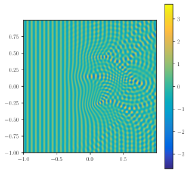
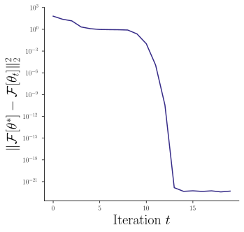
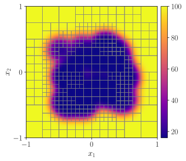

# ha-hps
Hardware Acceleration for HPS Methods in Two and Three Dimensions

## How to use this repository:
Set up the environment with conda:
```
conda create --name ha-hps python=3.10 --file env.yaml
conda activate ha-hps
```

Then, if you'd like, you can run the tests to make sure that everything is setup correctly:
```
python -m pytest hps/test/ -v
```


## Usage

We can solve sample 2D problems very quickly. Here is a sample command to run a timing script. This command takes 2 time samples for a problem with `L=8` levels of uniform refinement, using `p=16` Chebyshev nodes in each dimension on the leaves. The `--recomputation Ours` option runs the optimized code which either executes everything on the GPU or uses our recomputation strategy to minimize data transfers between the GPU and host. 
```
python driver_time_solver.py \
-n_samples 2 \
-l 8 \
-p 16 \
-out_fp data/large_problem_instance.mat \
--recomputation Ours
```

## Experiments

### H-P Convergence for 2D Problems

This experiment measures the accuracy of our solver on two different 2D problems, one which is solved using DtN matrices and the other which is solved using ItI matrices. 

To run the experiment,
```
python hp_convergence_example.py --l_vals 1 2 3 4 5 6 --p_vals 4 8 12 16 --DtN --ItI
```
To plot the experiment, 
```
plot_hp_convergence_experiment.py
```

### Wave Scattering Self-Convergence



This experiment measures the self-convergence of our HPS solver on a variable-medium wave scattering problem with 33 or 66 wavelengths across the computational domain.

This experiment can be reproduced by:

1. Run the matlab script `exterior_bie_matlab_scripts/loop_gen_SD.m` to generate single- and double-layer potential matrices for different discretization sizes.
2. Compute and save a reference solution by running:
```
sh scripts/wave_scattering_compute_reference_solns.sh
```
3. On a system with a GPU, measure the timing and accuracy by running:
```
sh scripts/wave_scattering_compute_approx_solns_gauss_bumps.sh
sh scripts/wave_scattering_compute_approx_solns_GBM_1.sh
```
4. Plot results by running
```
python wave_scattering_plot_results.py --prefix k100_soln -k 100
python wave_scattering_plot_results.py --prefix k200_soln -k 200
```

### Inverse Wave Scattering Example



This experiment uses automatic differentiation to solve an inverse medium scattering problem. To run the experiment:
```
python inverse_wave_scattering_example.py --n_iter 20
```
And then to generate plots: 
```
python plot_inverse_wave_scattering_example.py
```

### Linearized Poisson-Boltzmann Equation



To compute adaptive discretizations and solutions for the linearized Poisson-Boltzmann example, run the scripts in `scripts/poisson_boltzmann_example_*`. There are different scripts for different Chebyshev polynomial orders, and different versions of the permittivity function. 

### 3D Wave Front Problem
This experiment compares errors and runtimes for a 3D problem with an analytical solution that has a local region of non-smoothness. This is the type of experiment that we expect adaptive grid refinement to help a lot on.

This experiment can be reproduced by:
1. On a system with a GPU, run the adaptive 3D problem driver for adaptive and uniform meshing:
```
sh scripts/wave_front_3D_adaptive_p_8.sh
sh scripts/wave_front_3D_adaptive_p_12.sh
sh scripts/wave_front_3D_adaptive_p_16.sh
sh scripts/wave_front_3D_uniform.sh
```
2. Run the plotting code 
```
python plot_adaptive_meshing_accuracy_3D.py
```
