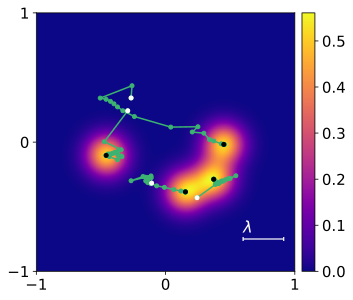
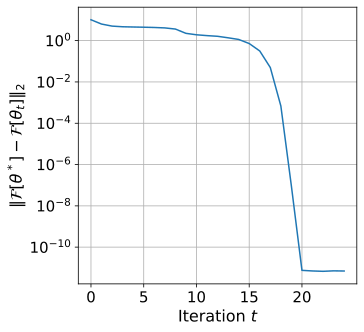
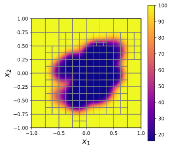

Examples
=============

In the source repository, we include code for a few example uses of the HPS routines. The code for these examples is not distributed in the ``hahps`` package, but it is available `in the examples directory of the source repository <https://github.com/meliao/ha-hps/tree/main/examples>`_.

hp convergence on 2D problems with known solutions
-----------------------------------------------------

Shows convergence using uniform quadtrees with both DtN matrices and ItI matrices. This example uses solution methods :func:`hahps.build_solver` and :func:`hahps.solve` to solve the PDE problem.

.. code:: bash

   python examples/hp_convergence_2D_problems.py --DtN --ItI

The example problems being solved are a Dirichlet problem with variable coefficients (DtN case) and a variable-coefficient Helmholtz problem with a Robin boundary condition (ItI case). Plotting the results should show convergence of the :math:`\ell_\infty` error at rate :math:`O(h^{p-2})`, where :math:`h` is the side length of the leaves of the discretization tree.

High-wavenumber scattering problem
------------------------------------

The high-wavenumber scattering example is a GPU implementation of the solver presented in [1]_. The solver is constructed using our :func:`hahps.upward_pass_subtree` routine to generate a top-level ItI matrix, sets up and solves boundary integral equation to enforce the radiation condition, and then propagates impedance data to the interior points using the :func:`hahps.downward_pass_subtree` routine.

First, run the MATLAB script ``examples/driver_gen_SD_matrices.m``. This will generate and save exterior single and double-layer kernel matrices. These matrices are necessary to define a boundary integral equation for the scattering problem.
Once the matrices are in place in place, we can run the script:

.. code:: bash

   python examples/wave_scattering_compute_reference_soln.py \
            --scattering_potential gauss_bumps \
            -k 100 \
            --plot_utot

This will generate plots which looks like this, showing the scattering potential and real part and modulus of the total field: 

.. image:: images/k_100_gauss_bumps_q.svg
   :align: center
   :width: 300
   :alt: Showing the scattering potential, a sum of randomly-placed Gaussian bumps.

.. image:: images/k_100_gauss_bumps_utot_ground_truth_real.svg
   :align: center
   :width: 300
   :alt: Showing the real part of the total wave field of a scattering problem where k=100 and the scattering potential is a sum of randomly-placed Gaussian bumps.

.. image:: images/k_100_gauss_bumps_utot_ground_truth_abs.svg
   :align: center
   :width: 300
   :alt: Showing the absolute value of the total wave field of a scattering problem where k=100 and the scattering potential is a sum of randomly-placed Gaussian bumps.

Inverse wave scattering using automatic differentiation
------------------------------------------------------------

We use the inverse wave scattering solver presented above to demonstrate the use of automatic differentiation with our solver. 
This example is a 2D inverse scattering problem where we try to recover the locations of four Gaussian bumps which make up the scattering potential. Using automatic differentiation with our code is simple. We want to be able to compute Jacobian-vector products:

.. math::

   J[\theta_t] v,

where :math:`J[\theta_t]` is the Jacobian of the forward model evaluated at :math:`\theta_t`, and :math:`v` is an arbitrary vector. We also want to compute vector-Jacobian products:

.. math::

   v^H J[\theta_t].

Computing both of these objects is easy:

.. code:: python
  
   import jax
   # See the examples directory in the source repo
   from inverse_scattering_utils import forward_model

   # vjp_fn : v -> v^\top J[\theta_t]
   # u_t = forward_model(theta_t)
   u_t, vjp_fn = jax.vjp(forward_model, theta_t)

   # Need to conjugate because we're using complex numbers
   vjp_fn = lambda v: vjp_fn(v.conjugate()).conjugate()

   # Jv is the evaluation of J[\theta_t] v, not a function.
   _, Jv = jax.vjp(forward_model, (theta_t,), (v,))

To run the example, use the command line:

.. code:: bash

   python examples/inverse_wave_scattering.py --n_iter 20

In this example, we try to recover the locations of four Gaussian bumps which make up the scattering potential. 
Running the code should produce plots showing the optimization variables converging at the centers of the Gaussian bumps in the scattering potential, as well as a plot showing the convergence of the objective function:

Adaptive discretization on a 3D problem with known solution
------------------------------------------------------------

We have a script for generating adaptive discretizations on the wavefront problem presented in our paper:

.. code:: bash

   python examples/wavefront_adaptive_discretization_3D.py -p 10 --tol 1e-02 1e-05

This should produce an image showing the computed solution, generated grid, and error map for each specified tolerance level. Here is the result for the tolerance level :math:`10^{-5}`:

.. image:: images/wavefront_soln_tol_1e-05.svg
   :align: center
   :height: 300
   :alt: Showing the computed solution, the adaptive grid, and the errors on a 2D slice of our 3D wavefont probelm.

Adaptive discretization on the linearized Poisson--Boltzmann equation
------------------------------------------------------------------------

We have a script for generating adaptive discretizations of the linearized Poisson--Boltzmann equation applied to a simulated molecular configuration with 50 atoms:

.. code:: bash

   python examples/poisson_boltzmann_example.py --tol 1e-01 1e-02 -p 10

This should produce output giving information about the generated grid and solution time for each specified tolerance level. In addition, it plots the generated grid with the permittivity. Here is the result for the tolerance level :math:`10^{-4}` and polynomial degree :math:`p=10`:

.. [1] Gillman, A., Barnett, A.H. & Martinsson, PG. A spectrally accurate direct solution technique for frequency-domain scattering problems with variable media. `Bit Numer Math` 55, 141–170 (2015). `<https://doi.org/10.1007/s10543-014-0499-8>`_
